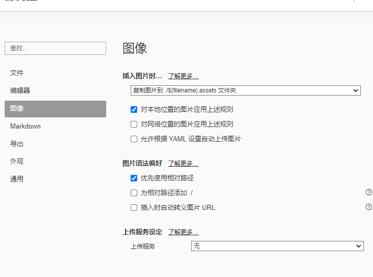

**1.一些基础操作**

| **格式** | **对应语法**   | **输出效果**                                                 |
| -------- | -------------- | ------------------------------------------------------------ |
| 加粗     | `**文字**`     | **文字**                                                     |
| 斜体     | `*文字*`       | *文字*                                                       |
| 删除     | `~~文字~~`     | ~~文字~~                                                     |
| 高亮     | `==文字==`     | <mark>红色高亮</mark>                                        |
| 超链接   | `[标题](网址)` | [我的主页]([亿万君9的个人空间-亿万君9个人主页-哔哩哔哩视频](https://space.bilibili.com/3494360857446413?spm_id_from=333.788.0.0)) |
| 有序序列 | `1. 第一项`    | 1. 第一项                                                    |
| 无序序列 | `- 序列`       | 表格无法演示                                                 |
| 其他需要 | 加一些插件     | 后续会做                                                     |

设置偏好设置中图像路径为相对路径，这样更加方便管理

MarkDown格式的优势主要是排版方便可实现纯键盘操作,且可移植性强，多网站兼容