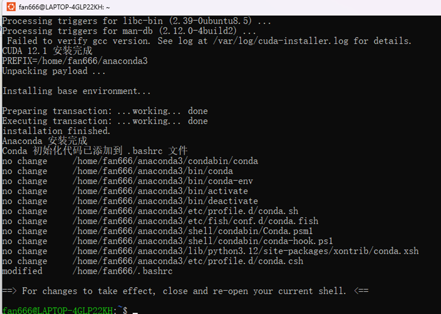
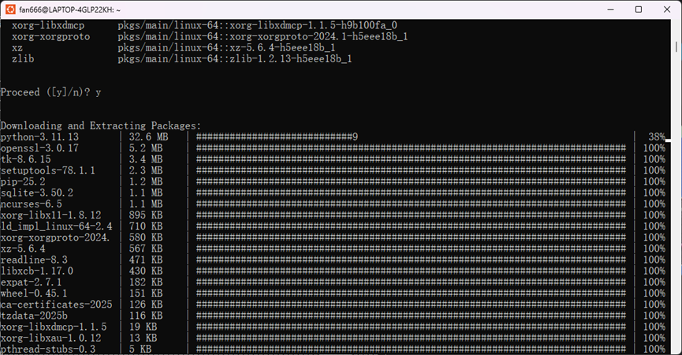
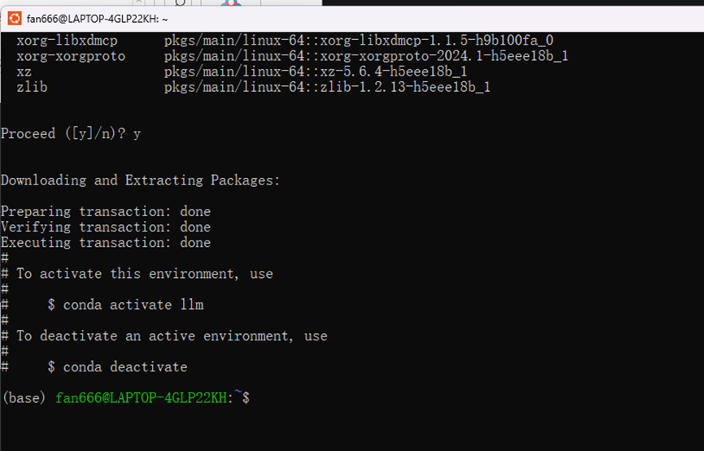
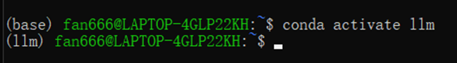
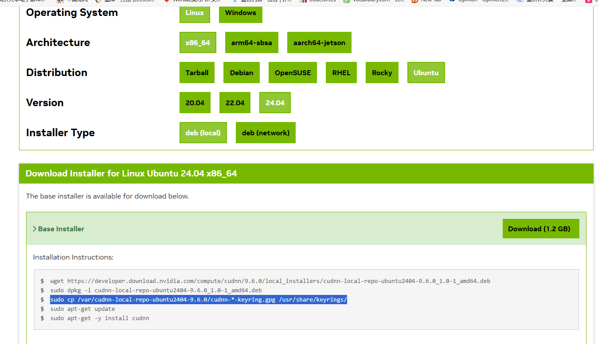
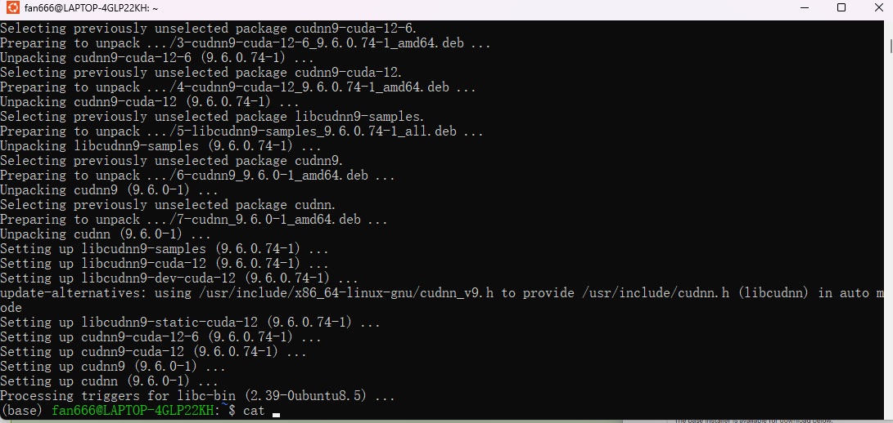

- **由于操作过急,WSL和Windows下Linux主系统的配置操作未记录**

- **接下来是Conda,Cuda,Cudnn的环境搭建**

Conda和Cuda直接使用了花子大大分享的文件进行环境配置，[链接]([5分钟学会在Windows上搭建模型训练环境 | WSL安装| CUDA | Conda | Unsloth_哔哩哔哩_bilibili](https://www.bilibili.com/video/BV1iatTeGENk/?vd_source=e2d12716b993a87920764eed661ac1eb))

配置后效果为

使用conda进行python3.11环境配置

激活python环境

​                               

- **然后是Cudnn插件的配置,进入英伟达官网找到[下载链接]([cuDNN Archive | NVIDIA Developer](https://developer.nvidia.com/rdp/cudnn-archive))**

我选择的是9.6.0按照官方指令进行配置，完成安装

