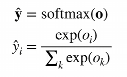
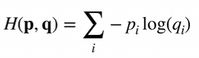
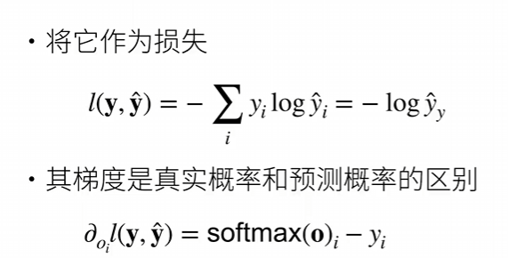

****

- 回归是用来估计一个连续值的

- 而分类预测一个离散类别：

分类通常有多个输出，输出为每个预测目标的置信度

1. 对类别进行一位有效编码
2. 目标：让正确类的置信度最大，且远远大于其他类  
3. 输出:匹配概率(非负，和为1)，softmax的作用就是让最后yi的求和为1

使用交叉熵来衡量两个概率的区别

你问为什么上面那个求和等式可以化简，因为y是独热编码，除了我们需要的以外都是0，只有一个是1

记住，我们只关心对正确类的概率

