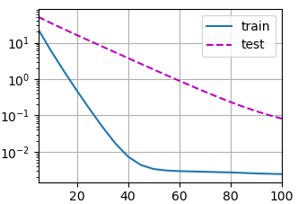

****

## 感知机


和回归差不多，不过回归的输出是实数，而感知机输出的是一个类


#### 训练感知机

当输出小于等于0时，对其进行一次更新

w变为w+yx   b变为b+y

#### 等价损失函数

l(y,x,w)=max(0,-y<w,x>)

#### 收敛定理


感知机不能拟合XOR函数，它只能产生线性分割面，使得在那个时代无法进行下去


后来出现了新的解决办法叫做多层感知机

## 多层感知机

### 单隐藏层

输入层输出到隐藏层，隐藏层输出到输出层


这里一定要有sigma，因为哪怕你多层迭代，线性组合后还是线性，要有激活函数弄成非线性的


### 激活函数

#### SIgmoid激活函数


将非连续函数变为相对平缓的连续函数

#### Tanh激活函数


#### ReLU激活函数


使用softmax来进行多类分类

多隐藏层用于解决复杂的问题，输入比较多，输出比较少，隐藏层越往高宽度越小,超参数越少，

超参数为隐藏层数，和各个隐藏层的大小


****

### 权重衰退(实际作用是在每次迭代中缩小lamda倍)

使用均方范数作为硬性限制


使用均方范数作为柔性限制

通过拉格朗日乘子来证明   lamda=0,无罚数 ，lamda趋于无穷大，w都趋于0


实际测试coding

```python
`import torch`

`from torch import nn`

`from d2l import torch as d2l`

`import matplotlib.pyplot as plt`

`n_train,n_test,num_inputs,batch_size=20,100,200,5`

`true_w,true_b=torch.ones((num_inputs,1))*0.01,0.05`

`train_data=d2l.synthetic_data(true_w,true_b,n_train)`

`train_iter=d2l.load_array(train_data,batch_size)`

`test_data=d2l.synthetic_data(true_w,true_b,n_test)`

`test_iter =d2l.load_array(test_data,batch_size,is_train=False)`

`def init_params():`

  `w=torch.normal(0,1,size=(num_inputs,1),requires_grad=True)`

  `b=torch.zeros(1,requires_grad=True)`

  `return [w,b]`

`def l2_penalty(w):`

  `return torch.sum(w.pow(2))/2 #平方求和再除以2`

`def train(lambd):`

  `w,b=init_params()`

  `net,loss=lambda X: d2l.linreg(X,w,b),d2l.squared_loss`

  `num_epochs,lr=100,0.003`

  `animator = d2l.Animator(xlabel='epochs', ylabel='loss', yscale='log',`

​    `xlim=[5, num_epochs], legend=['train', 'test'])`

  `for epoch in range(num_epochs):`

​    `for X,y in train_iter:`

​      `\#增加了L2范数惩罚项,`

​      `l=loss(net(X),y)+lambd*l2_penalty(w)`

​      `l.sum().backward()`

​      `d2l.sgd([w,b],lr,batch_size)`

​    `if(epoch+1)%5==0:`

​      `animator.add(epoch+1,(d2l.evaluate_loss(net,train_iter,loss),`

​             `d2l.evaluate_loss(net,test_iter,loss)))`

  `plt.show()`

  `print('w的L2范数是',torch.norm(w).item())`

`train(0)`
```

当我们给lamda为0是得到的误差图如下      范数为13.476920127868652


可以直观的感受到过拟合

当我们的柔性限制lamda给到3时，拟合得到如下结果，过拟合明显变弱  w的范数为0.37




当lamda给到8时,效果更好了   w的范数为0.0519


然后时第二种解决过拟合的方法

## dropout

这个的作用是在每次训练时随机去掉一部分神经元所起的作用,然后使得其他的神经元也可以拟合出来不错的效果，当然你去掉了以后最后的实际输出肯定会变小，所以在定概率随机抛弃一部分的隐藏神经元时身下的要除以(1-p)，来使得最后的输出量级差不多

```python
`以下是代码:`

`import torch`

`from torch import nn`

`from d2l import torch as d2l`

`import matplotlib.pyplot as plt`

`def dropout_layer(X,dropout):`

  `assert 0<= dropout <=1`

  `if dropout ==1:`

​    `return torch.zeros_like(X)`

  `if dropout ==0:`

​    `return X`

  `mask=(torch.randn(X.shape)>dropout).float()`

  `return mask *X/(1.0 - dropout)`
```

我们继续拟合之前的minist数据集,创建两层隐藏层,每个隐藏层256个神经元，由于超参数数量非常大，所以很容易出现过拟合的现象，我们看一下无dropout的训练情况和dropout1=0.2,dropout2=0.5的情况


虽然前者的训练精确度和训练集准确度非常的高，但是到测试集上时出现了明显的过拟合现象,再看后者在训练集上的误差和准确性都有些欠缺，但是在测试集上的准确性几乎等于训练集上，有很强的广泛性
