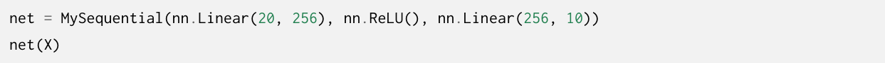

****

#### 层和块

nn.Sequential是一个重要的Module

任何的一个层都是Module的一个子类

看一下自定义类

自定义一个模型，它继承了nn.Module,nn.Module内部有很多集成好的部分，使用起来非常方便,再class自定义一个后，灵活性会更高，我们的自定义需要补充两个部分,一个是初始化,一个是正向传播方式

看上面这个就是先用系统初始化完成基础参数,然后我们自己建立两层运算，输入到隐藏,隐藏到输出,隐藏层为256+

forward是前向传播：流程是输入X作用后到隐藏层，再激活，再输出

反向不用定义，因为就是求梯度

​	

这里做了一个MySequential，其实和Pytorch定义的Sequential才差不多,结合着看一下上面的Init和下面的net定义

